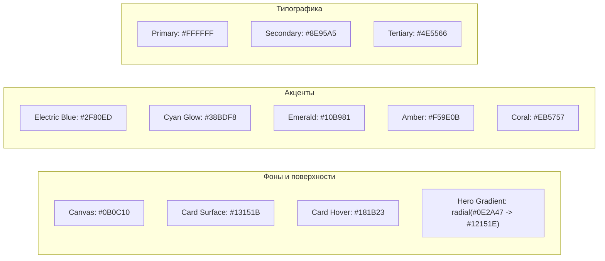

# CargonaOS — UI Design System & Component Guidelines
> **Основано на референсе**: [`reference/template.png`](file:///C:/Users/User/Desktop/CargonaOS/reference/template.png)  
> **Дизайн-модули**: `ui-design`, `design-systems`, `interaction-design`, `visual-critique`

---

## 1. Концепция и эстетика (Visual Identity)

Интерфейс CargonaOS спроектирован в стиле **Dark Neo-Fintech / Luxury WMS**:
- Глубокий премиальный ночной фон с мягким свечением и радиальными градиентами.
- Контрастные плавающие карточки со скруглением `rounded-2xl` и едва заметными субтильными границами (`border-white/[0.07]`).
- Четкое разделение на функциональные зоны: секционный сайдбар, информативный хедер, hero-виджеты с градиентным свечением и круглые кнопки быстрых действий (Action Pills).
- Крупная, легко читаемая типографика с идеальной кириллицей (Inter / Plus Jakarta Sans).

---

## 2. Цветовая палитра и токены (Color System)



### 2.1 Токены Tailwind CSS:
```javascript
// tailwind.config.js
module.exports = {
  theme: {
    extend: {
      colors: {
        background: '#0B0C10',
        surface: {
          DEFAULT: '#13151B',
          hover: '#181B23',
          border: 'rgba(255, 255, 255, 0.07)',
          subtle: 'rgba(255, 255, 255, 0.03)',
        },
        accent: {
          blue: '#2F80ED',
          cyan: '#38BDF8',
          glow: '#0E2A47',
          emerald: '#10B981',
          coral: '#EB5757',
        },
        text: {
          primary: '#FFFFFF',
          secondary: '#8E95A5',
          tertiary: '#4E5566',
        }
      },
      borderRadius: {
        'xl': '14px',
        '2xl': '20px',
        '3xl': '28px',
      },
      boxShadow: {
        'glow-blue': '0 0 30px -5px rgba(47, 128, 237, 0.25)',
        'card': '0 4px 20px -2px rgba(0, 0, 0, 0.5)',
      },
      fontFamily: {
        sans: ['Plus Jakarta Sans', 'Inter', 'system-ui', 'sans-serif'],
      }
    }
  }
}
```

---

## 3. Анатомия компонентов (Component Anatomy)

### 3.1 Сайдбар с категориями (Categorized Floating Sidebar)
Сайдбар как в референсе разделен на изолированные смысловые блоки:
```html
<!-- Контейнер сайдбара -->
<aside class="w-64 min-h-screen bg-[#0B0C10] p-4 flex flex-col justify-between">
  <div class="space-y-6">
    <!-- Блок 1: Основное -->
    <div class="bg-[#13151B] border border-white/[0.06] rounded-2xl p-2 space-y-1">
      <a class="flex items-center gap-3 px-3 py-2.5 rounded-xl bg-white/[0.06] text-white font-medium">
        <div class="w-8 h-8 rounded-lg bg-accent-blue/20 flex items-center justify-center text-accent-cyan">
          <IconHome class="w-5 h-5" />
        </div>
        <span>Главная</span>
      </a>
      <a class="flex items-center gap-3 px-3 py-2.5 rounded-xl text-text-secondary hover:text-white hover:bg-white/[0.03] transition">
        <div class="w-8 h-8 rounded-lg flex items-center justify-center text-text-secondary">
          <IconPackage class="w-5 h-5" />
        </div>
        <span>Посылки</span>
      </a>
    </div>

    <!-- Блок 2: Склад и ПВЗ (Аккордеон) -->
    <div>
      <div class="text-[11px] font-semibold text-text-tertiary tracking-wider px-3 mb-2 uppercase">Операции</div>
      <div class="bg-[#13151B] border border-white/[0.06] rounded-2xl p-2 space-y-1">
        <a class="flex items-center justify-between px-3 py-2.5 rounded-xl text-text-secondary hover:text-white hover:bg-white/[0.03]">
          <div class="flex items-center gap-3">
            <IconBarcode class="w-5 h-5" />
            <span>Приемка (Scan & Go)</span>
          </div>
          <span class="text-xs bg-accent-blue/20 text-accent-cyan px-2 py-0.5 rounded-full font-mono">F1</span>
        </a>
        <a class="flex items-center justify-between px-3 py-2.5 rounded-xl text-text-secondary hover:text-white hover:bg-white/[0.03]">
          <div class="flex items-center gap-3">
            <IconQrCode class="w-5 h-5" />
            <span>Выдача в ПВЗ</span>
          </div>
          <span class="text-xs bg-emerald-500/20 text-emerald-400 px-2 py-0.5 rounded-full font-mono">F2</span>
        </a>
      </div>
    </div>
  </div>

  <!-- Блок выхода -->
  <div class="pt-4">
    <button class="w-full flex items-center gap-3 px-4 py-3 rounded-2xl text-accent-coral hover:bg-accent-coral/10 transition font-medium">
      <IconLogout class="w-5 h-5" />
      <span>Выход</span>
    </button>
  </div>
</aside>
```

---

### 3.2 Премиальный Хедер (Header with Welcome & Controls)
Как на скриншоте:
- **Логотип слева**: стилизованный контрастный значок + имя компании (например, `CARGONA` или бренд тенанта).
- **Приветствие**: `Добро пожаловать, ` `<span class="font-bold text-white">@username</span>`.
- **Правый служебный блок**:
  - Переключатель языка: `🌐 RU` в аккуратном чипе.
  - Валюта: `RUB / USD / TJS` в чипе.
  - Тема: иконка полумесяца 🌙.
  - Профиль: круглая иконка с инициалом.

---

### 3.3 Главный Hero-виджет с глубоким радиальным градиентом
Центральная карточка из референса — это визитная карточка интерфейса:
- Глубокий синий туман в верхнем левом углу: `bg-[radial-gradient(ellipse_at_top_left,_var(--tw-gradient-stops))] from-[#0E2A47] via-[#12151E] to-[#13151B]`.
- Огромная ключевая цифра по центру (Оборот за сегодня, Вес на складе, или Долг).
- Переключатели валюты/режима прямо внутри карточки в виде матовых бейджей (`RUB`, `USD`, `КГ`).
- Скрытые кнопки действий в правом верхнем углу (иконка глаза для скрытия баланса, иконка настроек/фильтра).

---

### 3.4 Круглые кнопки быстрых действий (Action Buttons)
В референсе под карточкой баланса расположены стильные круглые кнопки с подписью:
```html
<div class="flex items-center justify-around gap-4 p-4 bg-[#13151B] border border-white/[0.06] rounded-2xl">
  <!-- Вторичная кнопка (плюс) -->
  <button class="group flex flex-col items-center gap-2">
    <div class="w-12 h-12 rounded-full bg-[#1A1D24] border border-white/[0.08] flex items-center justify-center text-white group-hover:scale-105 transition">
      <IconPlus class="w-5 h-5" />
    </div>
    <span class="text-xs font-medium text-text-secondary group-hover:text-white">Приемка</span>
  </button>

  <!-- Акцентная главная кнопка (синяя) -->
  <button class="group flex flex-col items-center gap-2">
    <div class="w-12 h-12 rounded-full bg-accent-blue shadow-glow-blue flex items-center justify-center text-white group-hover:scale-105 transition">
      <IconArrowUp class="w-5 h-5" />
    </div>
    <span class="text-xs font-medium text-white">Выдать по QR</span>
  </button>

  <!-- Круглая кнопка рейса -->
  <button class="group flex flex-col items-center gap-2">
    <div class="w-12 h-12 rounded-full bg-[#1A1D24] border border-white/[0.08] flex items-center justify-center text-white group-hover:scale-105 transition">
      <IconTruck class="w-5 h-5" />
    </div>
    <span class="text-xs font-medium text-text-secondary group-hover:text-white">Отправить рейс</span>
  </button>
</div>
```

---

### 3.5 Таблицы и списки активов / посылок
Строки таблицы строятся по принципу карточек:
- Иконка статуса / аватар в круглом цветном контейнере слева.
- Заголовок и подзаголовок (например, `Трек SF109481` / `Обувь, 4.2 кг`).
- Центральные метрики (объем, плотность, дата).
- Правая колонка: жирная цифра стоимости или статуса с мини-спарклайном/графиком или цветным бейджем (`На складе`, `В пути`, `В ПВЗ`).

---

## 4. Адаптация под Telegram Mini App (Мобильный клиент)
Те же цвета и скругления переносятся в мобильный формат для клиентов:
- **Фон**: `#0B0C10`.
- **Карточка профиля клиента**: точно такой же красивый синий градиент, как на десктопе, с карго-кодом `MIR-523`.
- **По центру**: огромный, контрастный QR-код выдачи.
- **Табы**: аккуратные матовые таблетки `Ожидаются`, `В пути`, `В ПВЗ`.
- **Штрихкоды и статусы**: крупные плашки со статусом и фото коробки при клике.
