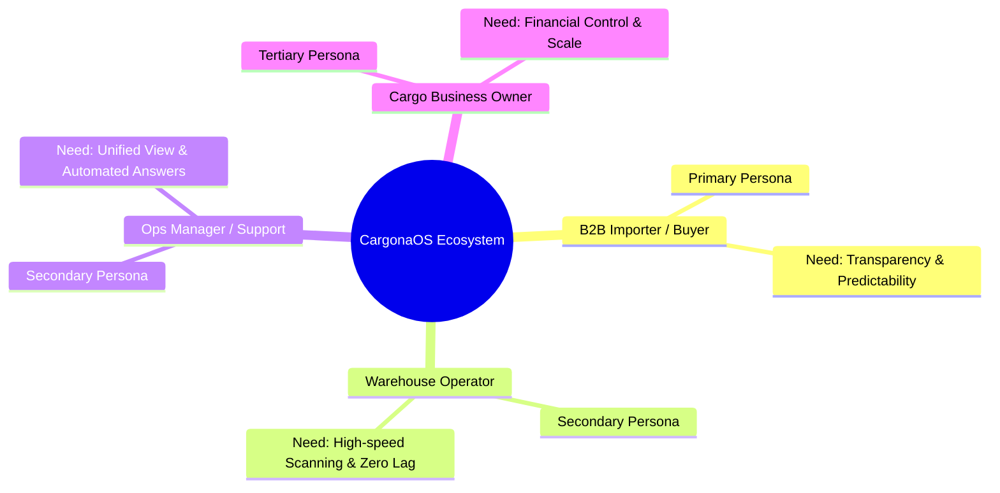
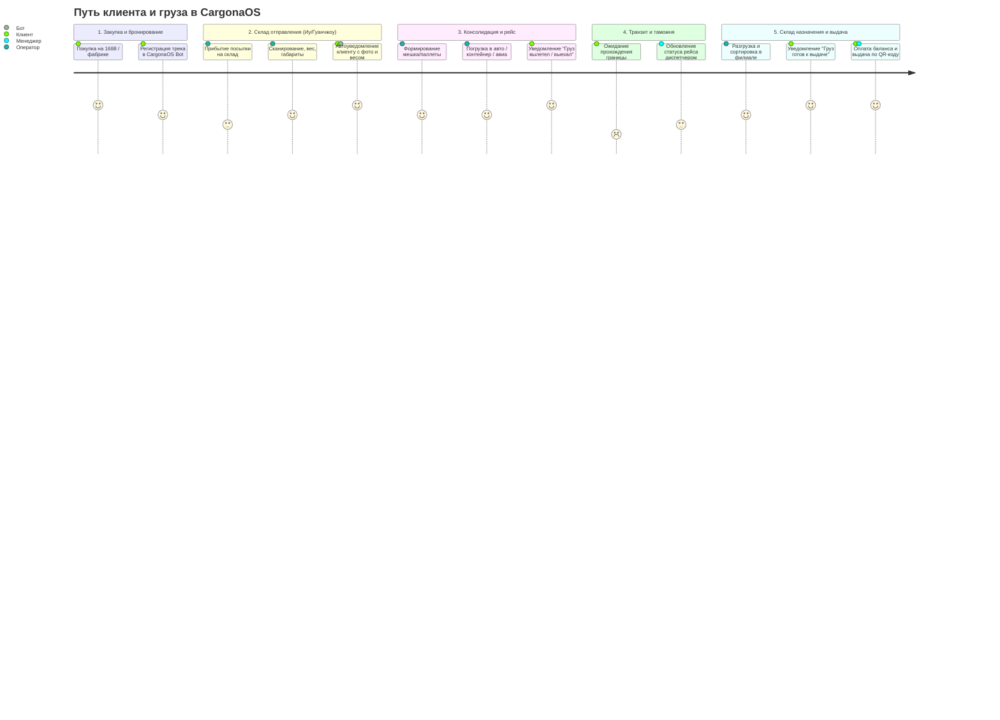

# CargonaOS — User Research & Discovery Report
> **Workflow**: `/design-research:discover`  
> **Target Product**: **CargonaOS** (Universal Multi-tenant Logistics & Cargo SaaS)  
> **Methodology**: Persona Generation, Empathy Mapping, User Journey Mapping, JTBD Synthesis

---

## 1. Executive Summary & Research Scope

**CargonaOS** is a multi-tenant operational SaaS platform designed to centralize and automate cross-border and domestic cargo operations (e.g., China → Central Asia, Turkey → CIS/Europe, UAE → Middle East/Africa, USA/Europe → Global).

Today, independent cargo operators run critical logistics infrastructure on an ad-hoc cocktail of:
- Messy Telegram groups and manual chats ("Где мой трек?", "Сколько за куб?")
- Fragile Excel sheets edited by multiple employees simultaneously
- Paper warehouse manifests, handwritten package labels, and loose payment receipts
- Untracked cash/transfer payments leading to discrepancies and revenue leaks

The discovery cycle identifies 4 key behavioral personas, maps their emotional and operational friction points across the cargo lifecycle, and synthesizes strategic product requirements.

---

## 2. User Personas

---

### Persona 1: Фарух (Farrukh) — The Commercial Importer (Primary Persona)
> *"Мне не нужны отмазки, мне нужно знать точную дату рейса и где коробки сейчас."*

- **Demographics**: 34 года, владелец магазина электроники и аксессуаров, Ташкент / Душанбе.
- **Tech Comfort**: Высокий (Telegram, 1688, Taobao, WeChat, Kaspi / Alif).
- **Archetype**: B2B Commercial Buyer / Wholesaler.
- **Volume**: 150–500 кг в месяц, 10–25 отдельных коробок от разных поставщиков.

#### Goals:
- **Functional**: Своевременно консолидировать заказы с 1688/Taobao на складе в Иу/Гуанчжоу, отправить одним рейсом, получить в целости с прозрачным расчетом по весу/объему.
- **Emotional**: Спокойствие за инвестированные оборотные средства; отсутствие страха потери груза на таможне.
- **Social**: Репутация надежного поставщика перед своими розничными покупателями.

#### Frustrations & Pain Points:
- Поставщики с 1688 отправляют без маркировки или путают трек-номера.
- Приходится по 10 раз писать в WhatsApp/Telegram менеджеру карго: «Пришел ли трек 78291823912?», а ответ приходит через сутки: «Ищем на складе».
- Неожиданные скачки тарифов или скрытые доплаты (за обрешетку, плотность, скотч) в момент выдачи.
- Долгая очередь на выдаче товара на складе назначения.

#### Day-in-the-life Scenario:
Фарух закупает 40 позиций на 1688. Копирует 15 китайских трек-номеров курьерских служб (ZTO, SF Express). Вставляет их в заметки, затем вручную пересылает в чат карго. Каждый день обновляет чат в надежде узнать, приехал ли груз на склад консолидации. Через 2 недели ему звонят со склада: «Приезжайте забирать, долг $840», но у него нет детализации по весу каждой коробки.

#### Design Implications for CargonaOS:
- Telegram WebApp / Bot для мгновенной регистрации трек-номеров клиентом еще до прибытия на склад.
- Автоматические Push/Telegram-уведомления при каждом изменении статуса: `Получен на складе в Иу` → `Взвешен (12.4 кг)` → `В пути (Авиа/Авто)` → `Готов к выдаче`.
- Прозрачный калькулятор стоимости с разбивкой: тариф за кг/м³ + доп. услуги.

---

### Persona 2: Ли Вэй / Алишер — Warehouse Operator (Origin/Destination)
> *"Если сканирование занимает больше 3 секунд на коробку, склад встанет."*

- **Demographics**: 26 лет, оператор приемки и сортировки, склад Иу / Гуанчжоу / склад выдачи.
- **Tech Comfort**: Средний (терминалы сбора данных, смартфоны, базовый китайский/русский).
- **Archetype**: Fast-paced Physical Worker.

#### Goals:
- **Functional**: Быстро отсканировать входящие 1500 посылок за смену, взвесить, измерить габариты (Д×Ш×В), наклеить внутренний штрихкод карго и привязать к клиенту по коду карго.
- **Emotional**: Закончить смену без недостач и штрафов за неверный вес.
- **Social**: Слаженная работа с бригадой упаковщиков и грузчиков.

#### Frustrations & Pain Points:
- Нечитаемые, затертые китайские штрихкоды.
- Медленный интерфейс (каждый клик «сохранить» с задержкой в 2 секунды превращается в часы простоя).
- Посылки «без опознавательных знаков» (нет кода клиента на коробке) — приходится откладывать в «неопознанные» (lost & found) и тратить время на ручной поиск.
- Необходимость переключаться между клавиатурой, весами и сканером.

#### Day-in-the-life Scenario:
В 11:00 приезжает грузовик китайской экспресс-доставки с 800 посылками. Алишер берет беспроводной сканер штрихкода. Он сканирует китайский трек, бросает коробку на электронные весы, нажимает одну горячую клавишу. Если код клиента распознан, термопринтер мгновенно выплевывает наклейку карго `CARGO-9941`. Если код не указан, система должна в один клик отправить фото в раздел «Неопознанные».

#### Design Implications for CargonaOS:
- Keyboard-first UI + поддержка сканеров HID (эмуляция клавиатуры) без необходимости кликать мышью в поле ввода.
- Высокоскоростной режим пакетной приемки (Batch Receiving Mode) со звуковыми подсказками (зеленый сигнал — успех, красный гудок — клиент не найден / дубликат).
- Интеграция с термопринтерами (Zebra, Xprinter) через веб-печать (ESC/POS, TSPL).

---

### Persona 3: Зарина (Zarina) — Customer Care & Dispatch Manager
> *"Я трачу 70% дня, отвечая на вопрос 'Где мой груз?' вместо того, чтобы продавать рейсы."*

- **Demographics**: 28 лет, ведущий менеджер по работе с клиентами, головной офис карго.
- **Tech Comfort**: Высокий (Excel, CRM, Telegram Desktop, WhatsApp Web).
- **Archetype**: Multi-tasking Coordinator.

#### Goals:
- **Functional**: Обрабатывать запросы сотен клиентов, выставлять счета, отслеживать дебиторскую задолженность, контролировать выдачу только после оплаты.
- **Emotional**: Избавиться от хаоса сообщений и вечерних разборок по поводу недостач.
- **Social**: Быть профессиональным и вежливым лицом компании.

#### Frustrations & Pain Points:
- 5 разных Telegram-чатов на каждого клиента; данные о платежах лежат в телефоне бухгалтера.
- Склад назначения иногда выдает коробки клиенту в долг без подтверждения руководства.
- При задержке рейса приходится вручную писать каждому клиенту или получать сотни гневных звонков.

#### Design Implications for CargonaOS:
- Единое окно клиента: баланс, история грузов, статус посылок, неоплаченные счета на одном экране.
- Автоматический запрет выдачи (Block Release on Debt) на складе до отметки бухгалтера или внесения наличных.
- Массовые уведомления по рейсу: при обновлении статуса рейса `Авторейс #412 задержан на границе` все клиенты рейса получают апдейт автоматически.

---

### Persona 4: Рустам (Rustam) — Cargo Company Owner / Director
> *"Бизнес растет, но я не вижу реальную прибыль из-за бардака на складах и зависших долгов."*

- **Demographics**: 42 года, предприниматель, основатель карго-компании со складами в Китае, Турции и 3 филиалами выдачи.
- **Tech Comfort**: Средний (iPhone, Telegram, банковские приложения).
- **Archetype**: Growth & Profitability Minded Operator.

#### Goals:
- **Functional**: Видеть загрузку рейсов (объем, вес, рентабельность), контролировать остатки на складах, предотвратить воровство и серые схемы сотрудников.
- **Emotional**: Уверенность в контроле над бизнесом и масштабируемости без найма десятков новых учетчиков.
- **Social**: Статус лидирующей и самой надежной карго-компании в регионе.

#### Frustrations & Pain Points:
- «Черные дыры» на складах — коробки лежат месяцами, занимая место.
- Сложность введения новых тарифов (индивидуальные скидки постоянным клиентам часто забываются или путаются).
- Отсутствие сводного финансового отчета в реальном времени.

#### Design Implications for CargonaOS:
- Дашборд руководителя: чистая прибыль рейса, дебиторка, динамика объема (кг / м³), среднее время доставки (SLA).
- Гибкая тарифная сетка: базовые тарифы по направлениям + персональные скидки/надбавки для клиентов.
- Ролевая модель с разграничением прав (склад не видит финансы, менеджеры видят только своих клиентов).

---

## 3. Empathy Maps

### Empathy Map: Фарух (B2B Клиент)

| Quadrant | Content |
| :--- | :--- |
| **SAYS** | • «Мой товар уже 3 дня на вашем складе в Иу, почему он еще не взвешен?» • «Почему плотность посчитали по $3.2 вместо $2.8, как договаривались?» • «Пришлите фото коробки, поставщик говорит, что отправил 5 штук.» |
| **THINKS** | • *«Не разобьют ли хрупкий товар при перегрузке?»* • *«Успеет ли товар до праздников, иначе я потеряю сезонные продажи.»* • *«Меня не обманывают с округлением веса?»* |
| **DOES** | • Проверяет китайские треки 5 раз в день на сайте курьерской службы. • Пересылает скриншоты накладных менеджерам в личные сообщения. • Сам едет на склад выдачи, чтобы поторопить выдачу коробок. |
| **FEELS** | • Тревога и беспомощность из-за отсутствия информации в пути. • Раздражение от необходимости звонить нескольким людям для одного ответа. • Облегчение, когда груз проверен и получен в целости. |

**Key Insight**: Клиенту важна не столько скорость физической доставки, сколько **предсказуемость и честная информация** о текущем статусе.

---

### Empathy Map: Алишер (Warehouse Operator)

| Quadrant | Content |
| :--- | :--- |
| **SAYS** | • «Этот штрихкод помят, сканер не берет.» • «На коробке написано только имя 'Мухаммад', а код карго не указан. Чей это груз?» • «Машина загружена под завязку, где манифест на выезд?» |
| **THINKS** | • *«Хоть бы система не зависла посреди выгрузки фуры.»* • *«Не хочу перевешивать вручную 300 позиций из-за ошибки в программе.»* • *«Главное не перепутать паллету авиа с паллетой авто.»* |
| **DOES** | • Быстро работает сканером в одной руке и маркером в другой. • Ставит неопознанные коробки в угол «до выяснения». • Перекладывает коробки в мешки и формирует паллеты. |
| **FEELS** | • Физическая усталость от непрерывного темпа погрузки. • Стресс от ответственности за целостность чужих грузов. • Удовлетворение, когда фура заполнена и все манифесты сошлись до килограмма. |

**Key Insight**: Оператору склада нужен интерфейс, требующий **ноль лишних движений**: горячие клавиши, звуковые сигналы и автоматическая печать этикеток.

---

## 4. User Journey Map (End-to-End Cargo Lifecycle)

### Детальная матрица этапов пути:

| Этап | Цели пользователя | Точки контакта (Touchpoints) | Эмоциональное состояние | Болевые точки (Pain Points) | Возможности CargonaOS (Design Opportunities) |
| :--- | :--- | :--- | :--- | :--- | :--- |
| **1. Предварительный заказ (Pre-transit)** | Быстро внести трек-номера, присвоить понятные метки («чехлы», «куртки»). | Telegram WebApp / Бот, ЛК веб. | 🙂 Спокойствие, ожидание (+1) | Много трек-номеров, неудобно копировать по одному. | Массовая вставка треков списком; автоопределение формата курьерки. |
| **2. Приемка на складе (Origin Hub)** | Зафиксировать факт поступления, подтвердить вес и объем. | Сканер ТСД, Термопринтер, Весы. | 😐 Напряжение / Фокус (0) | Посылки без кода клиента; задержка синхронизации данных. | Режим «Быстрая приемка»; модуль «Неопознанные посылки» с отправкой фото в канал/бот. |
| **3. Консолидация и отправка рейса** | Объединить коробки в рейсовую партию (паллета/мешок), рассчитать баланс рейса. | Админ-панель склада, мобильный сканер. | 🙂 Уверенность (+1) | Пересортица, потерянные коробки при перегрузке. | Двухэтапная валидация загрузки рейса (проверка сканированием всех вложений). |
| **4. Транзитный маршрут (Transit)** | Знать, где находится партия и выдерживается ли плановый срок. | Telegram-уведомления, трекер статуса. | 😟 Тревога, нетерпение (-1) | Таможенные задержки без объяснения причин; молчание поддержки. | Прозрачные промежуточные статусы: `В пути к границе`, `Таможенное оформление`, `Прибытие в хаб`. |
| **5. Прибытие и выдача (Destination Hub)** | Быстро оплатить доставку и получить груз без очередей. | Склад выдачи, QR-код клиента, Касса. | 😃 Радость, облегчение (+2) | Очереди при поиске на полках; споры по итоговой стоимости. | Выдача по персональному QR-коду клиента; адресное хранение на складе выдачи (Стеллаж-Полка). |

---

## 5. Jobs-to-Be-Done (JTBD) Framework

### Core Job:
> **«Когда я заказываю партию товаров за рубежом, я хочу передать логистику прозрачной системе, чтобы товар прибыл вовремя и по понятной цене без необходимости ежедневного ручного контроля.»**

| Измерение | Job Statement | Критерий успеха |
| :--- | :--- | :--- |
| **Функциональное (Functional)** | Когда поставщик отправляет коробки, я хочу внести треки в систему и увидеть их консолидированный вес и стоимость. | Ни один трек не потерян; расчет стоимости прозрачен до цента. |
| **Эмоциональное (Emotional)** | Когда груз находится в транзите через границу, я хочу регулярно получать подтверждения его движения, чтобы не переживать за сохранность капитала. | Чувство уверенности и контроля 24/7 без звонков менеджерам. |
| **Социальное (Social)** | Когда мои клиенты спрашивают сроки поступления товара, я хочу давать точные даты, чтобы выглядеть солидным бизнесом. | Высокая лояльность розничных покупателей и отсутствие сорванных поставок. |

---

## 6. Moments of Truth (Критические точки)

1. **Момент первой приемки в Китае/Турции**:  
   Клиент получает первое уведомление: *«Ваша посылка получена складом в Гуанчжоу. Вес: 8.4 кг, Объем: 0.04 м³. Фото прикреплено»*. В этот момент рождается доверие к карго-компании.
2. **Момент задержки рейса**:  
   Если рейс задерживается, система обязана проактивно уведомить клиента с указанием причины (погода, таможенная проверка) до того, как клиент начнет звонить в панике.
3. **Момент выдачи на складе назначения**:  
   Клиент показывает один QR-код из Telegram-бота, кладовщик сканирует его, система показывает точные ячейки на складе, сумму к оплате и выдает груз за 60 секунд.

---

## 7. Приоритетные требования к UX/UI CargonaOS

1. **Telegram-First клиентский опыт**:
   - Полнофункциональный Telegram WebApp: список треков, баланс, уведомления, карточка клиента с персональным QR-кодом для склада.
2. **Клавиатурно-ориентированный интерфейс склада**:
   - Обработка посылки за < 2 секунд без мыши (Enter для подтверждения, авто-фокус в поле трека, горячие клавиши для нестандартных ситуаций).
3. **Модуль неопознанных грузов (Lost & Found)**:
   - Если китайский трек поступил без кода клиента, кладовщик делает фото, и оно мгновенно попадает в общую ленту неопознанных в боте, где клиенты могут заявить права на посылку.
4. **Финансовая дисциплина и адресное хранение**:
   - Автоматическая блокировка статуса «Выдано» при отрицательном балансе клиента (с возможностью супервизорского override).
   - Адресный учет на складах выдачи (Зона - Ряд - Полка) для ликвидации очередей.
