# 📦 Cargona — Презентационный фото-отчёт продукта

**Цель презентации:** наглядная демонстрация экосистемы Cargona для потенциальных клиентов (карго-компаний, логистических хабов и фулфилментов).
**Бренд:** Cargona  
**Префикс кодов клиентов:** `CRG` (`CRG-001`, `CRG-002`...)  
**URL сервиса:** [https://cargona.akii.world](https://cargona.akii.world)
**Дата создания:** 23.09.2026, 18:26:30
**Количество материалов:** 11 скриншотов высокой чёткости (@2x/@3x Retina)

---

## 🖥 Разделы системы и скриншоты

### 1. Главный аналитический дашборд руководителя Cargona
**Файл:** `01-dashboard-overview.png`  
**Маршрут:** `/o/cargona/dashboard`  
**Разрешение:** `1440x900`  
**Назначение:** Главный аналитический дашборд руководителя Cargona: сводные KPI, объем принятых грузов, баланс касс филиалов, активные рейсы и быстрые действия  

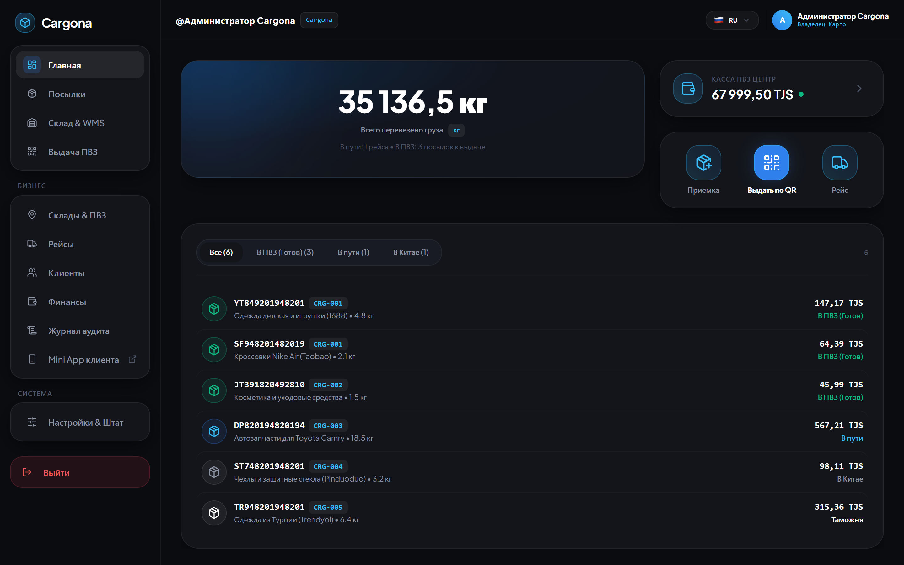

---

### 2. Модуль WMS и адресного склада
**Файл:** `02-wms-intake-scanner.png`  
**Маршрут:** `/o/cargona/wms`  
**Разрешение:** `1440x900`  
**Назначение:** Модуль WMS и адресного склада: высокоскоростной сканер штрихкодов, расчет веса, кубатуры, площади и плотности, назначение ячеек и полок хранения  

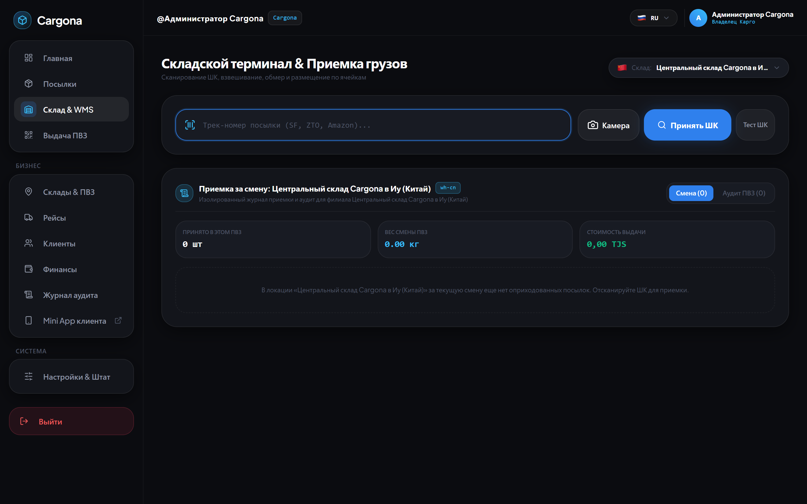

---

### 3. Журнал посылок и трекинг
**Файл:** `03-packages-tracking-table.png`  
**Маршрут:** `/o/cargona/packages`  
**Разрешение:** `1440x900`  
**Назначение:** Журнал посылок и трекинг: фильтры по статусам (В пути, Готов к выдаче, На складе), быстрый поиск по трек-номерам, карго-кодам CRG и ячейкам  

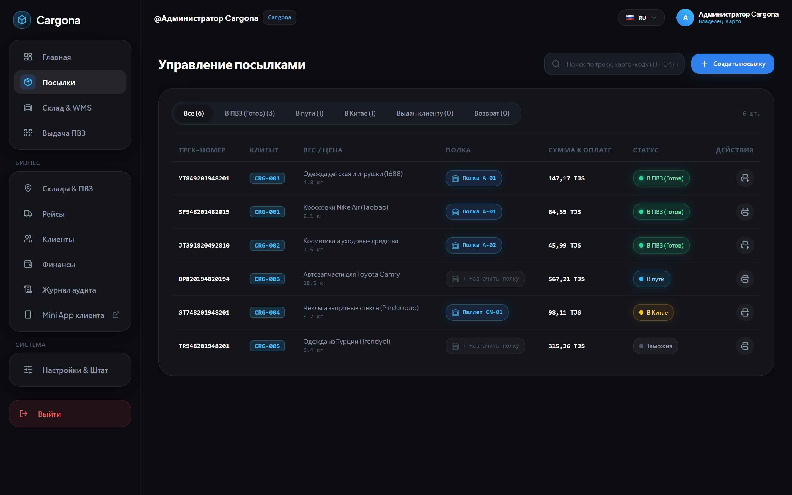

---

### 4. Управление рейсами и манифестами
**Файл:** `04-trips-manifest-management.png`  
**Маршрут:** `/o/cargona/trips`  
**Разрешение:** `1440x900`  
**Назначение:** Управление рейсами и манифестами: отслеживание авто-фур и авиа-рейсов (Китай → Таджикистан), весовые лимиты, погрузка тарных мест и пломб  

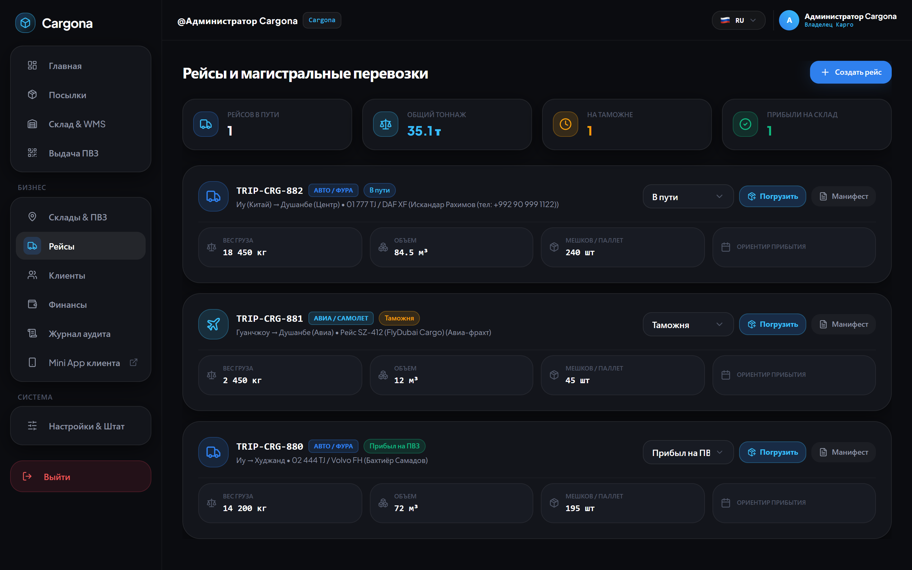

---

### 5. Клиентская база и Cargo ID
**Файл:** `05-customers-crm-balances.png`  
**Маршрут:** `/o/cargona/customers`  
**Разрешение:** `1440x900`  
**Назначение:** Клиентская база и Cargo ID: карточки клиентов с персональными кодами (CRG-001...), история балансов, Telegram-привязка и выбор ПВЗ  

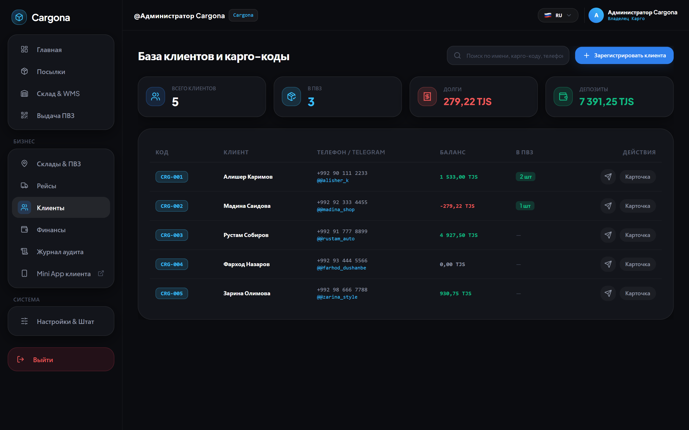

---

### 6. Сеть филиалов ПВЗ и международные хабы
**Файл:** `06-branches-storage-cells.png`  
**Маршрут:** `/o/cargona/branches`  
**Разрешение:** `1440x900`  
**Назначение:** Сеть филиалов ПВЗ и международные хабы: склады в Китае (Иу), Турции (Стамбул) и ОАЭ (Дубай), управление кассой и адресной сеткой ячеек  

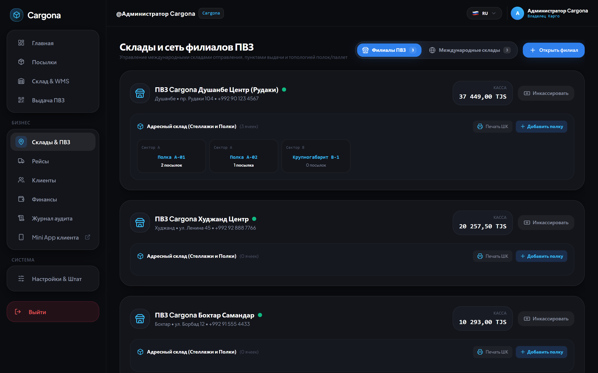

---

### 7. Финансы и аналитика доходности
**Файл:** `07-finance-cash-analytics.png`  
**Маршрут:** `/o/cargona/finance`  
**Разрешение:** `1440x900`  
**Назначение:** Финансы и аналитика доходности: учет касс всех филиалов в реальном времени, графики выручки и кнопка мгновенной инкассации  

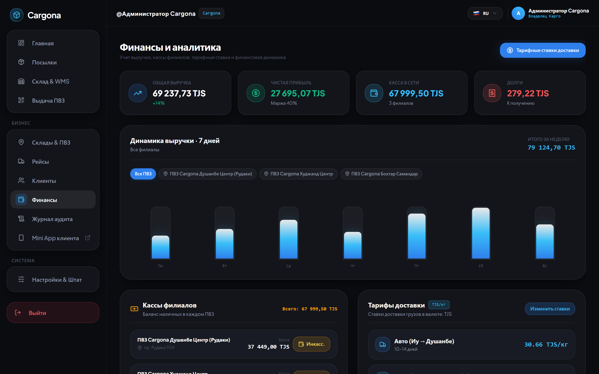

---

### 8. Настройки компании Cargona и BYOB Telegram-бота (@cargona_bot)
**Файл:** `08-settings-byob-bot.png`  
**Маршрут:** `/o/cargona/settings`  
**Разрешение:** `1440x900`  
**Назначение:** Настройки компании Cargona и BYOB Telegram-бота (@cargona_bot): подключение токена, тарифные ставки за кг, международные склады отправки  

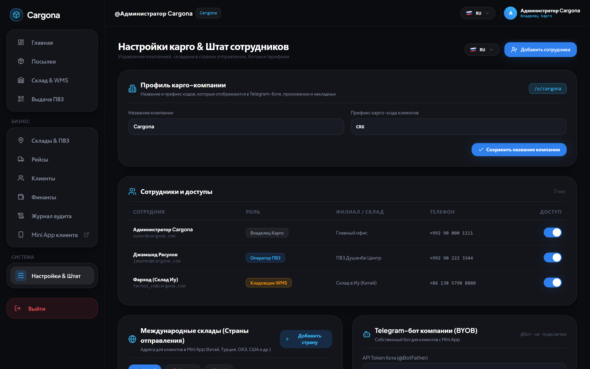

---

### 9. Панель управления платформой CargonaOS для супер-администратора
**Файл:** `09-superadmin-platform-panel.png`  
**Маршрут:** `/admin`  
**Разрешение:** `1440x900`  
**Назначение:** Панель управления платформой CargonaOS для супер-администратора: подключение новых карго-компаний, управление тарифами SaaS и лимитами  

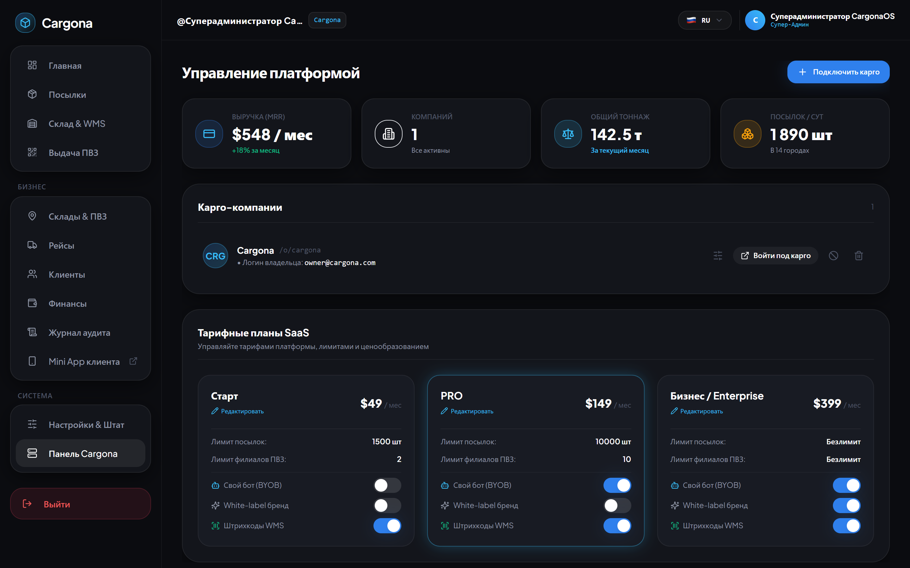

---

### 10. Telegram Mini App клиента Cargona
**Файл:** `10-miniapp-client-dashboard.png`  
**Маршрут:** `/o/cargona/app`  
**Разрешение:** `393x852 (Mobile)`  
**Назначение:** Telegram Mini App клиента Cargona: персональный код CRG-001, баланс, готовые к выдаче посылки, адреса складов в Китае и Турции для 1688, Taobao, Trendyol  

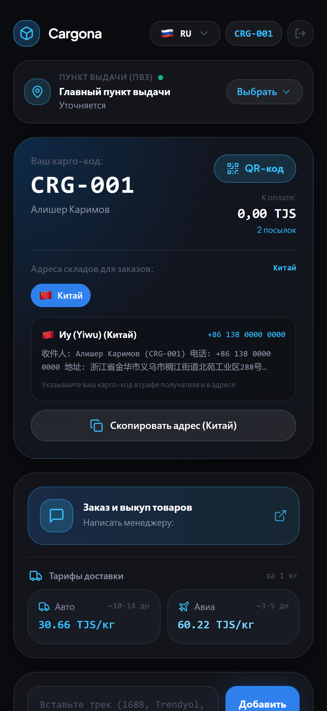

---

### 11. Telegram Mini App
**Файл:** `12-miniapp-registration-apple-flag.png`  
**Маршрут:** `/o/cargona/app (Register)`  
**Разрешение:** `393x852 (Mobile)`  
**Назначение:** Telegram Mini App: форма регистрации нового клиента Cargona с Apple-style выбором кода страны/флага (+992, +998, +7, +86...) и удобного ПВЗ  

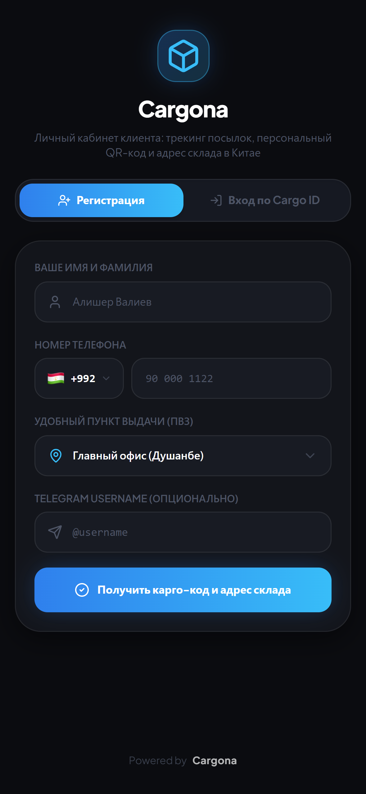

---

